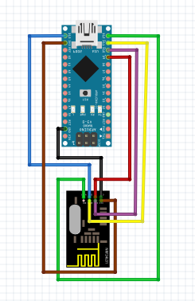

# nrf24l01_to_serial

Read message from the radio. Check if message contains ; which is used to end message. If message contains ; then write message to serial if message doesn't contain ; then don't write it since it's useless.

